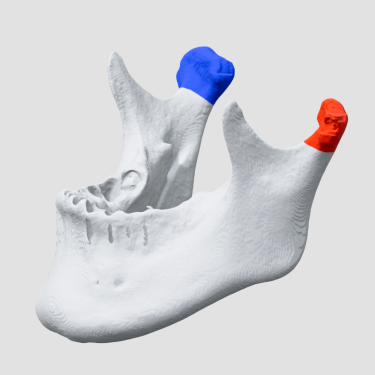

<p align="center">
  
</p>

# Mandible Registration

**口扫与 CBCT STL 的下颌位姿传递、髁突位移分析和剖面测量工具。**

[](https://github.com/Henry0222/mandible_registration)
[](https://www.python.org/)
[](LICENSE)

Mandible Registration 是一个面向个人研究和几何验证的 Windows 桌面应用。它把两个时间点的上下颌口扫、CT 全牙列和下颌骨组织成固定的六 STL 工作流，通过三阶段刚性配准将口扫中的下颌位姿变化传递给 CT 下颌骨，随后提供阶段复核、髁突中心位移分析和双侧剖面取点测距。可额外导入一个上颌骨/颅底 STL，作为共同坐标中的固定参考。

本仓库包含源代码、测试和 Windows 便携版构建配置，**不包含患者数据、口扫或 CBCT/STL 测试文件**。程序只读取输入模型，不覆盖原始 STL。

> [!WARNING]
> 本项目仅用于研究、学习和个人几何分析，不是医疗器械，不提供临床诊断或治疗决策。数字咬合、扫描、分割、选区和配准误差都会传递到最终测量结果。

## 主要功能

- 自动完成 CT 牙列定位、两次上颌对齐和下颌位姿变化三个刚性配准阶段。
- T_CT 多随机种子一致性检查，质量未通过时停止矩阵向颌骨传播。
- 可选的牙面重点选区、左右或单侧髁突面片选区。
- 独立的颌骨对比窗口，上方三维、下方双侧髁突剖面，支持轮廓取点测距。
- 髁突中心位移、实际移动方向、下颌顺逆旋及三维总旋转角分析。
- 保存 4×4 变换矩阵、模型哈希、质量指标和可追溯的 JSON 结果。

## 六 STL 输入与可选上颌骨

程序依次使用：

1. 第一次上下颌扫描模型
2. 下颌骨及全牙列模型
3. 第二次上下颌扫描模型

可选的上颌骨/颅底须与全牙列、下颌骨来自同一原始 CT 坐标。它只应用 `T_CT`，不参与三个配准阶段，也不生成时点 2 副本。六项必需输入齐全即可运行。

三个刚性配准阶段为：

```text
T_CT    = Reg(全牙列 -> 下颌口扫.1)
T_UPPER = Reg(上颌口扫.2 -> 上颌口扫.1)
T_DELTA = Reg(下颌口扫.1 -> T_UPPER * 下颌口扫.2)

颌骨.1 = T_CT * 颌骨
颌骨.2 = T_DELTA * T_CT * 颌骨
上颌骨.1 = T_CT * 上颌骨       # 可选固定参考
```

所有变换均为毫米坐标中的 4x4 刚性矩阵，不估计缩放或非刚性形变。

## 配准可靠性与限制

第一阶段默认不要求人工选择牙面片。CT 上下颌牙列可以保持为同一个 STL，算法按局部重叠完成 CT 牙列到下颌口扫.1 的定位；若自动结果不稳定，也可分别在“下颌口扫.1”和“全牙列”节点点击“选区”，为 T_CT 指定重点采样面。

`T_CT` 会至少使用两个不同随机种子计算。只有两次均达到覆盖、法向一致性和残差门槛（参考面覆盖率 ≥ 0.25、法向一致率 ≥ 0.70、P90 ≤ 0.80 mm），并且两个刚性矩阵之间相差不超过 2°/2 mm，矩阵才允许传递给颌骨；否则继续寻找一致解，最多五次。五次仍不一致时流程停止，保留最佳候选用于彩虹图检查，但不会传递给颌骨。每次尝试和两两差异均保存在 `stages` 目录。覆盖率来自几何匹配，并不是牙冠分割掩膜。

## 源码运行与开发

本项目通过正式 Python 包依赖通用配准核心，不读取相邻父目录源码。当前需要先取得并安装 `general_model_registration-2.0.0-py3-none-any.whl`，再安装本项目：

```powershell
python -m venv .venv
.\.venv\Scripts\python.exe -m pip install `
  "C:\path\to\general_model_registration-2.0.0-py3-none-any.whl"
.\.venv\Scripts\python.exe -m pip install -e ".[dev]"
```

开发虚拟环境准备完成后可直接双击：

```text
run_app.bat
```

或在本目录执行：

```powershell
.\.venv\Scripts\python.exe -m mandible_registration
```

## 使用测试数据运行无界面流程

```powershell
.\.venv\Scripts\python.exe -m mandible_registration `
  --dataset-dir "C:\path\to\six-stl-dataset" `
  --output-dir ".\outputs"
```

程序只读取输入 STL，不覆盖或修改原始文件。每次运行都会建立独立结果目录并保存输入摘要、三个阶段的矩阵、质量指标及两个下颌骨位置。


## 髁突选区与自动中心位移

- **中心定义**：所选三角面片的面积加权质心，不是简单顶点平均、球拟合中心或解剖旋转中心；中心可能位于骨内部，结果受选区范围影响。
- **保存**：选区自动写入 `outputs/condyle_selections`，与原始颌骨文件哈希绑定。新配准结果会在 `project.json` 中归档选区快照。旧结果也可补选：打开旧项目，导入的颌骨路径有效时点击选区，再回到测量窗口即可刷新，无需重做配准。
- **位移**：原始 CT 中心分别乘 `T_MANDIBLE_T0` 和 `T_MANDIBLE_T1`。共同 XYZ 坐标约定为左侧 +X、右侧 −X 为外移；两侧 −Y 为前移、+Z 为上移，反向分别为内移、后移、下移。实际移动方向和距离用黑色大字显示，XYZ 数值及与正轴夹角用灰色小字显示；该约定不会自动校正输入模型的解剖方向。
- **角度**：从 −X 观察、屏幕上方为 +Z 时，顺时针为下颌骨顺旋，反之为逆旋。黑字显示有符号 X 向旋转分量，灰字单独显示三维总旋转角。投影退化或 180° 方向不唯一时不强行归类。
- **导出**：侧栏可导出自动髁突位移及剖面测量 JSON，只创建新文件，不覆盖已有记录。schema 4 的旧 `measurements` 字段保留为空数组，剖面记录使用 `condyle_sections`；目前不支持重新导入测量 JSON。

## 颌骨对比与双侧剖面

通过“打开已有结果”载入 `project.json`，再打开“颌骨对比 / 测量”。对比窗口与主窗口可独立移动、最小化；关闭主窗口后，仍打开的对比窗口可以继续使用。主窗口仍在时，关闭对比窗口会隐藏并保留当前剖面测量，再次打开复用缓存。

- 三维旋转中心默认取左右 T0 髁突中心的中点，只有单侧选区时取该侧中心。
- 三维和剖面均采用平行投照，相同长度不会因远近产生大小变化；右键及滚轮通过调整视野范围缩放。
- 初次打开默认左侧信息栏与右侧视图区宽度为 1∶4，右侧三维与下方剖面区高度为 3∶2；分隔条可拖动调整，隐藏后重新打开保留已调整的位置。
- 三维及剖面均为左拖旋转、中拖平移、右拖缩放；三维滚轮缩放，剖面滚轮沿当前视线移层。旧三维手动标记、跨骨距离及四点角度功能已移除。
- 保存至少一侧髁突选区后，点击“启用双侧剖面”。左右各使用 T0 中心半径 20 mm 的球形 ROI，初始为世界 YZ 平面；三维始终同步显示截面位置。上颌骨不是启用条件，缺失骨面保持开口，不自动补洞。
- 各剖面启用“距离取点”后，左键短按选择可见轮廓点，测量两点间的毫米距离。可撤销、清空、返回已记录平面并导出。此功能不自动推断关节间隙。
- 模型只读取一次，左右剖面复用局部缓存。同一份百万面片模型实测启用由约 2.14 s 降至 0.75 s；具体耗时取决于模型和电脑。

当前流程图为 `src/mandible_registration/assets/workflow.maxilla.editable.svg`，保留可编辑文字与语义 ID。交互、方向定义、性能及复现脚本见 [修订验证记录](docs/condyle_sections_revision.md)。

## Windows 便携包

完整解压 `MandibleRegistration-v1.1.0-win64.zip` 后双击同名 EXE。请保留 `_internal` 等整个文件夹；目标电脑无需安装 Python 或相邻配准项目。

构建环境使用 `.venv-integration`，安装上述依赖及本项目开发依赖后运行 `build_windows.bat`。构建会运行测试，从当前源码收集应用模块、SVG 和图标，并核验资源后生成 ZIP 和 SHA-256 校验文件。发布包含使用说明、项目许可证及 Qt 许可证。

版本校验值和冻结版运行结果见 [v1.1.0 打包记录](docs/release-v1.1.0.md)。

## 许可证

本项目采用 [BSD 3-Clause License](LICENSE)。第三方依赖仍分别适用其各自许可证，详见 [THIRD_PARTY_NOTICES.md](THIRD_PARTY_NOTICES.md)。
